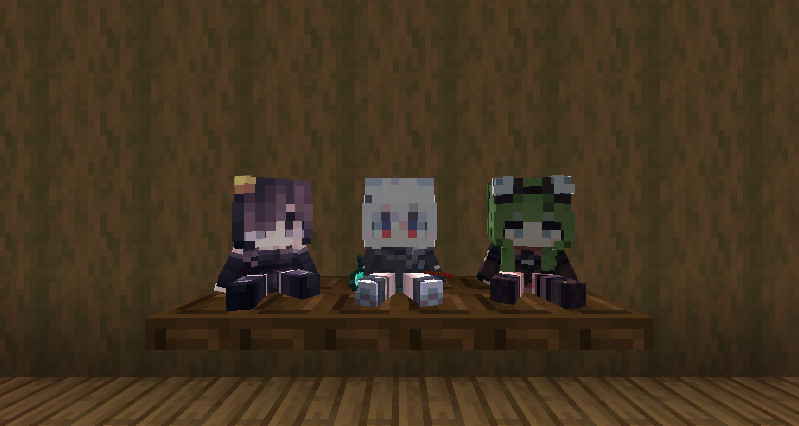

# PlayerDoll
A player skin doll implemented using **Shader**, allowing it to display player skins in real time without requiring additional skin textures.   
You can also configure custom items for the doll to hold, allowing for more varied and detailed appearances.

> [!WARNING]  
> ### Not compatible with shader packs!  
> PlayerDoll relies on a custom Shader included in the resource pack to render player skins. Due to Iris's Shader loading mechanism, when a shader pack is enabled, custom Shaders provided by resource packs will be ignored and replaced by the Shaders provided by the shader pack.  
> Due to the way PlayerDoll is implemented, this limitation cannot be resolved through configuration.



## Installation

1. Place the entire `PlayerDoll` folder into: `plugins/CraftEngine/resources/`
2. Run `/ce reload all` to reload CraftEngine.
3. Installation is complete.

## Usage

### Getting the Doll
```
/ce item get playerdoll:player_doll
```
The doll will use **your own player skin** by default.

### Changing the Doll's Skin
Hold the doll you want to modify in your main hand, then run:
```
/minecraft:item modify entity @s weapon.mainhand {function:"minecraft:set_components",components:{"minecraft:profile":"SkinName"}}
```
Replace `SkinName` with the name of the player whose skin you want to use.

### Changing the Items Held by the Doll
Hold the doll you want to modify in your main hand, then run:
```
/minecraft:item modify entity @s weapon.mainhand {function:"minecraft:set_custom_model_data",strings:{values:["RightHandItem","LeftHandItem"],mode:"replace_all"}}
```
The values are:
- The first value is the item held in the right hand
- The second value is the item held in the left hand

For example:
```
["diamond_sword","shield"]
```

The item names must already be registered in the PlayerDoll configuration: `PlayerDoll/configuration/player_doll.yml`

## Compatibility
- Minecraft version: 26.2
- Requires: CraftEngine
- Shader packs are not supported
- Other Minecraft versions may have compatibility issues.
